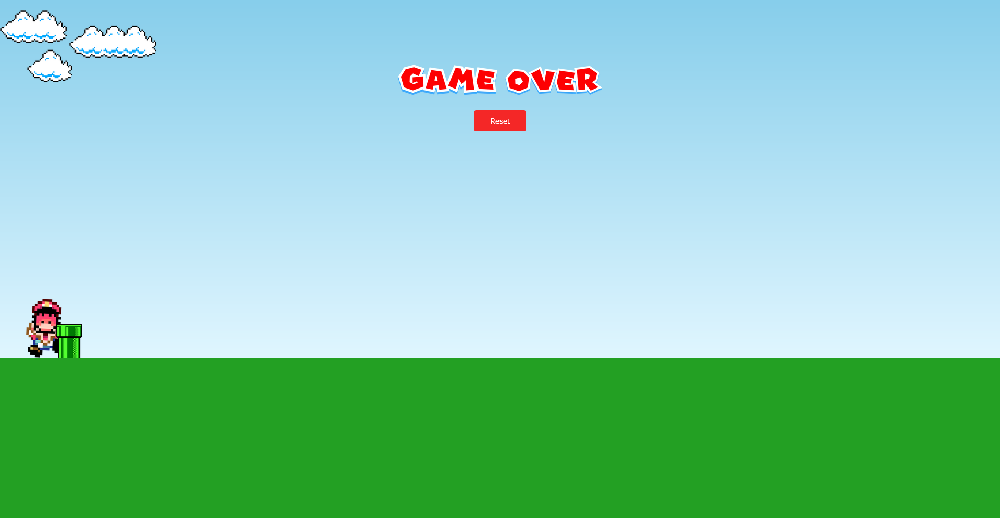

<h1 align="center">Mario jump</h1>

- [Acesse o projeto finalizado, online](https://mario-jump-ten.vercel.app/)

  

## 💻 Projeto

Mario Jump é um jogo da saga de jogos 2D, desenvolvido com js, onde foi possível entender sobre eventos, funções e manipulação de DOM.

 
## 🚀 Tecnologias

Esse projeto foi desenvolvido com as seguintes tecnologias:

- HTML
- CSS
- JavaScript

